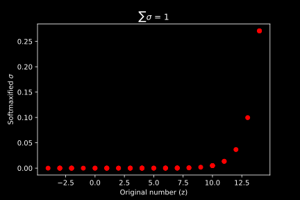

# Fundamentals

### This folder contains all the code files for prerequisites and the fundamentals required before trying out **Deep Learning**

__[00_gpu_test.py](https://github.com/IndraP24/Complete-Deep-Learning-with-PyTorch/blob/main/00_Fundamentals/00_gpu_test.py)__ - contains the basic test to check if PyTorch can access the GPU for computation

__[01_transpose.py](https://github.com/IndraP24/Complete-Deep-Learning-with-PyTorch/blob/main/00_Fundamentals/01_transpose.py)__ - contains the fundamentals of transpose and how to transpose a vector or a matrix using both Numpy and PyTorch

__[02_dotproduct.py](https://github.com/IndraP24/Complete-Deep-Learning-with-PyTorch/blob/main/00_Fundamentals/02_dotproduct.py)__ - contains the fundamentals of dot products and how to do a dot product of a vector and vector or a matrix and matrix using both Numpy and PyTorch

__[03_matmul.py](https://github.com/IndraP24/Complete-Deep-Learning-with-PyTorch/blob/main/00_Fundamentals/03_matmul.py)__ - contains the fundamentals of matrix multiplication and how to do matrix multiplication of two matrices

__[04_softmax.py](https://github.com/IndraP24/Complete-Deep-Learning-with-PyTorch/blob/main/00_Fundamentals/04_softmax.py)__ - contains the fundamentals of a softmax function and how to implement it from scratch using Numpy as well as plotting the data on a chart.

The data distribution obtained from Softmax using Numpy is:

  

